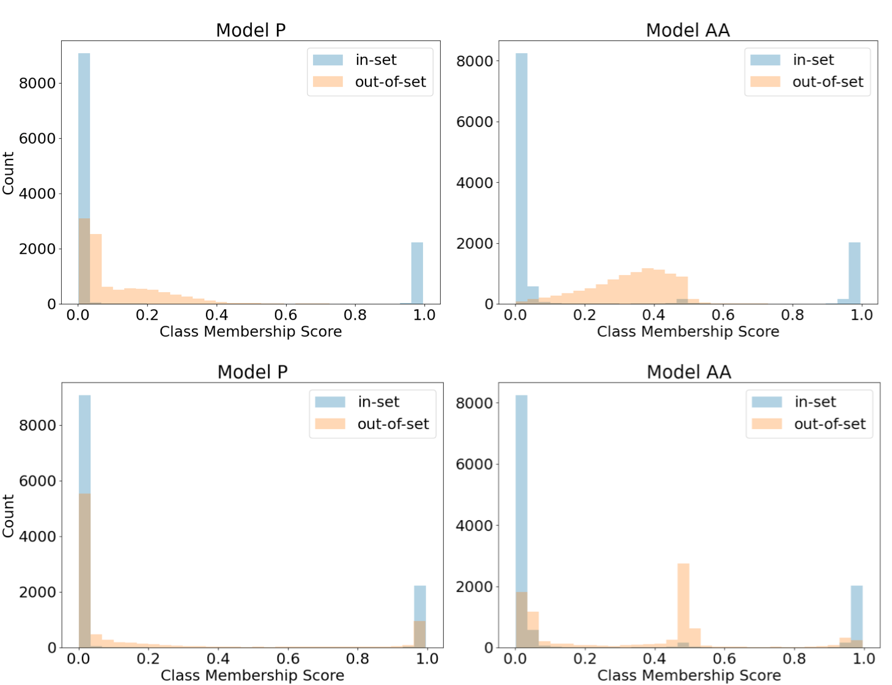

# Taming the Opinionated Transformer

## TLDR

In Prolego labs, we set out to develop an NLP model that would be robust to out-of-distribution data. Drawing on extensive research in the computer vision field, we trained a transformer that intrinsically predicts out-of-distribution data, as well as performing well at the multi-label classification task at hand. Not only that but this method is also surprisingly simple to implement. For additional details beyond this post, or to review our implementation, check out our (paper)[] and (code repository)[].(TODO: add links).

At the onset of this project, we agreed that there are a few crucial requirements that a viable solution must have:

1. It should be robust to unfamiliar data

In other words, the system should reliably detect out-of-distribution examples that are not available during training time, enabling rejections and/or further inspection of these examples.

2. It shouldn't degrade performance on the task at hand

The system should make accurate predictions for in-set examples.

3. It should be simple

Additional code and/or monitoring systems add maintenance overhead. An ideal solution minimizes the number of new components that are piled on top of the model.

To achieve these goals, we developed a training approach to generate a transformer model that returns confident scores for in-set data only and assigns agnostic scores (i.e., scores close to 0.5) for data that does not resemble the training data. Using our approach, the model is better able to identify unusual or unexpected examples supplied at inference time while not adversely affecting predictions on expected data. Furthermore, detection of OOD examples is intrinsic to the model itself, facilitating a faster path to production monitoring by not requiring a separate data monitoring solution. This approach has clear benefits for production-grade models and active learning.

## First, a story...

During one of my first forays into data science, my team and I developed a machine learning model that could automatically identify issues in an inspection process. We were thrilled! Our model checked all the boxes - it showed high precision/recall on the test set, it was quick to run, and it promised to provide a huge impact in an industry that, up until this point, was inefficient and prone to user error.

We deployed the model for user testing, and that's when things started to go wrong... The predictions were awful! It didn't take long for the users to learn to mistrust the system. And the business learned to mistrust the data scientists too.

What had gone wrong? We would come to find out that, unbeknownest to us, we were given a proxy dataset for model development under the assumption that the model would be able to generalize to similar (but still fundamentally different) production data. Our industry partners were not aware that generalization is very much an unsolved problem in machine learning. Many models in production work under the assumption that the data distribution will match the training data.

This story can teach several valuable lessons - work closely with your business partners, set up a data pipeline, manage expectations - but one important takeaway that I've seen play out over and over again is this: For any number of reasons, the data that your model is making predictions on may not match the training data, and you need to build systems that are robust to this.

## Why might a data set deviate from training data?

There are a variety of reasons why production data may not match training. The anecdote I shared above is an example of a data pipeline mismatch between training and inference data. Even if a pipeline is set up correctly at the onset of a project, however, upstream changes to the pipeline can occur abruptly and without warning. For example, the engineering team that manages the pipeline may discover a bug that has unknowingly transformed the data upon ingestion. They fix the bug but do not consider the implications for a downstream model that was trained on the original, transformed data.

Another common occurence is for end-user(s) to input erroneous data to the inference system. For instance, they submit an email message to a document analysis model that has been fine-tuned to extract legal language from contracts, or they accidentally upload a picture from their recent family vacation to a receipt analysis model that is part of a company reimbursement system.

Finally, it is possible (and in many cases inevitable) that data evolves and diverges over time until it no longer sufficiently resembles what was present at the time a model was trained. This phenomenon, called model drift, is overcome is some cases by regularly updating models using the newest available data. Depending on the industry, the feasibility of a CICD model training pipeline such as this can be impeded by regulatory restrictions.

## What can we do about it?

We've seen how out-of-distribution data can sneak into an inference pipeline. But how can we protect against this? One option would be to pick off issues one-by-one: Develop software QA processes that guard against upstream data pipeline changes. Train end-users to submit only expected data to the model.

Fundamentally, however, these issues expose a significant shortcoming of machine learning models. Namely, when presented with unfamiliar data, these models tend to fail both catastrophically and silently.

An alternative way to deal with failure scenarios is to develop a model that knows when it does not know. In other words, a model that is able to indicate uncertainty when data is presented that is different from the data presented during training. To draw inspiration for how to do this, we turn to an area in computer vision referred to as open set recognition.

## Open set recognition

Open set recognition refers to the concept of building models (e.g., object detection or image classification models) that can perform the task they were trained to do "in the wild," despite the presence of a multitude of irrelevant data that may exist. For example, a critical requirement of self-driving cars is that they can safely navigate through a variety of traffic and geography even if training data for a specific scenario was not present during model development.

Several approaches to solve the open set problem have been proposed[^1,^2, ^3]. In their 2018 paper, [Dhamija et al.](https://arxiv.org/abs/1811.04110) propose an framework for model training that computes loss separately for "foreground" and "background" images. During model training, agnostic labels are encouraged for the background case using a simple loss term to promote small and similarly valued logits for these examples. This approach is intriguing to us both because of the simplicity of the implementation and because it requires no post-hoc processing of outputs: Instead, the training approach promotes the concepts of uncertainty and robustness to never-before-seen data as intrinsic to the model itself. We take this work as inspiration for our approach and test its applicability in the context of out-of-set identification for multi-label text classification.

[^1 Abhijit Bendale and Terrance E. Boult. 2015. Towards open set deep networks. https://arxiv.org/abs/1511.06233 CoRR, abs/1511.06233.]
[^2 ODIN: https://arxiv.org/pdf/1706.02690.pdf, Shiyu Liang, Yixuan Li, R. Srikant, Enhancing The Reliability of Out-of-distribution Image Detection in Neural Networks, 2018, published in ICLR.]
[^3 https://arxiv.org/pdf/1711.09325.pdf]

## Our approach

For our experiment, we trained a transformer model to classify text snippets into five categories using the ApteMod version of the Reuters-21578 corpus[^4], available for download through [nltk](https://www.nltk.org/). This data set is a popular, publically available data source that assigns news snippets to one or more topics. For reasons that will soon become clear, we subdivided the Reuters data set into 3 partitions:

1. In-Set Positive: News snippets that contain at least one of the top 5 most prevelant topic labels

2. In-Set Negative: Examples that are not included in the In-Set Positive set, and that contain as least one of the 6th-10th most prevalant labels

3. Reuters-OOS (Out-of-Set): Remaining examples that are neither in the In-Set Positive nor the In-Set Negative set

To build a traditional 5-class multilabel classification model, we would train the model using only In-Set Positive examples and use a binary cross-entropy loss function during training to encourage the model to perform the multilabel classification task with high accuracy. Because our model should also be robust to out-of-distribution data, however, we make some modifications for our "Ambiguous-Aware" model to also learn this secondary goal. Specifically, we add the In-Set Negative examples to the training data and compute loss for these examples as the mean of the squared logits output by the network.

When a sigmoid activation is applied during inference, the class outputs for in-set examples (still trained using binary cross-entropy loss) should lie close to 0.0 or 1.0. For out-of-set data, however, the effect of the squared logit loss is to drive all class outputs to the ambiguous score of 0.5, since Sigmoid(0) = 0.5. This ambiguous score is model-speak for "I'm not sure."

[^4 The Reuters-21578, Distribution 1.0 test collection is available from David D. Lewis’ professional home page, currently: http://www.research.att.com/~lewis. The artifacts created using this data set are intended for research purposes only.]

## Evaluation

To evaluate our model, we consider two criteria:

1. How does the model perform on in-set data?

2. Do the model predictions allow us to dicriminate between in-set and out-of-set data?

To answer question #1, we compute the precision and recall of the trained model using examples from the In-Set Positive test set.

For question #2, we should use data that have never been seen by the model during training. Luckily, we've set aside a partition of the Reuters data set - Reuters-OOS - for just this reason! Reuters-OOS contains examples that are generally similar to the data used during training, but because they originate from different topic labels than the In-Set Positive or In-Set Negative classes, they contain slightly different language. Conceptually, the differences between in-set and Reuters-OOS data are similar to differences that would arise over time due to model drift.

We'd also like to test model performance on data that is significantly different from the in-set data. To do this, we use the Sentiment Polarity data set Version 2.0 [^5], which contains movie reviews and is also available through [nltk](https://www.nltk.org). Going forward, we'll refer to this data set as Movies-OOS. Like the Reuters data set, Movies-OOS also contains short snippets of English text. A quick comparison between some examples, however, reveals differences in tone and capitalization, among other things (Table 1). Conceptually, Movies-OOS mimics data deviations that may occur due to erroneous user inputs or upstream changes to the data pipeline.

| Reuters                                                                                                                                | Movie Reviews                                                                                                                                                      |
|----------------------------------------------------------------------------------------------------------------------------------------|--------------------------------------------------------------------------------------------------------------------------------------------------------------------|
| TRINITY INDUSTRIES INC &lt;TRN> SETS QUARTERLY Qtly div 12-1/2 cts vs 12-1/2 cts prior Pay April 30 Record April 15                    | i feel sorry for the financial backers of " waterworld , " which is supposedly the most expensive film ever made(at$172million! ) ,andisalsooneofthe               |
| DOLLAR OPENS AT A RECORD LOW FOR TOKYO AT 145.80 YEN - DEALERS DOLLAR OPENS AT A RECORD LOW FOR TOKYO AT                               | a costume drama set in the 1500s , england , elizabeth is a lush , romantic , political masterpiece about the upset over the crossing of a protestant queen from a |
| PHILADELPHIA PORT CLOSED BY TANKER CRASH The port of Philadelphia was closed when a Cypriot oil tanker, Seapride II, ran aground after | as feel-good formulaic as it may be in its own way , shall we dance ? also demonstrates a kind of charm- ing restraint you don’t often find in american films .    |
| BRENCO INC &lt;BREN> DECLARES QTLY DIV- IDEND Qtly div three cts vs three cts prior Pay April six Record March 20                      | under any other circumstances , i would not be dis- cussing the ending of a film to the extent that i will in this particular review . however , in order to fully |
Table 1: The first few lines of randomly selected text excerpts from the Reuters and Movie Reviews data sets.

For both the Reuters-OOS and Movies-OOS sets, we compute the area under the receiver operating curve (AUC) to measure the model's ability to discriminate between in-set data (from the In-Set Positive test set) and out-of-set data. In this case, AUC measures the model's ability to discriminate between in-set and out-of-set examples, rather than its traditional use in differentiating positive and negative examples.

An AUC of 1.0 indicates that the model can perfectly distinguish between the in- and out-of-set data distributions, while 0.5 indicates a complete inability to differentiate between the two.

[^5 Bo Pang and Lillian Lee. 2004. A sentimental education: Sentiment analysis using subjectivity summarization based on minimum cuts. In Proceedings of the ACL.]

## Experiment and results

We start with a RoBERTa foundation model available through [Hugging Face](https://huggingface.co/transformers/pretrained_models.html) and train the Ambiguous-Aware model using the modified loss function and training data discussed above (TODO: insert hyperlink to Our Approach section). For comparison against a baseline, we also train a standard five-class multilabel model, with no modifications to the loss to facilitate out-of-set data scoring.

Performance metrics for both the Baseline and Ambiguous-Aware models are shown in the table below:

|           | Baseline Model | Ambiguous-Aware Model |
|-----------|----------------|-----------------------|
| Precision | 0.983          | 0.984                 |
| Recall    | 0.975          | 0.968                 |

As you can see, precision and recall maintain similarly high values across the two models, indicating that there was no large degradation in performance due to differences in how the models were trained.

The table below displays the AUC values obtained from comparison of in-set vs. out-of-set data. While the Baseline model performs well on Movies-OOS, AUC drops using Reuters-OOS. The Ambiguous-Aware model, however, maintains consistently high AUC across the two data sets, indicating that the scores output by the model can be used to flag out-of-distribution predictions.

|             | Baseline Model AUC | Ambiguous-Aware Model AUC |
|-------------|--------------------|---------------------------|
| Movies-OOS  | 0.974              | 0.972                     |
| Reuters-OOS | 0.843              | 0.928                     |

Figure 1 displays histograms of output scores for In-Set Positive vs. Reuters-OOS and Movies-OOS data. Looking at the datat distributions for in-set vs. out-of-set data, you can start to understand where the Ambiguous-Aware model really shines. For the Baseline model, out-of-set data is scored similarly to negative class membership scores for in-set data, with both receiving a score close to 0.0. The Ambiguous-Aware model, however, returns high-confidence class membershp scores (i.e., scores that are close to 0.0 or 1.0) for in-set data only, and scores near 0.5 for out-of-set data. It's important to note that the agnostic model was not provided any data from the out-of-set category during training; Nevertheless, it appropriately returns uncertain scores for these examples.

Figure 1: Histograms of output scores for in-set vs. Movies-OOS (top) and Reuters-OOS (bottom) data for the Baseline and Ambiguous-Aware models. TODO: Change Model P --> Baseline Model, Model AA --> Ambiguous-Aware Model

One practical consideration for the OOD detection approach is selecting an appropriate confidence threshold for flagging data as likely out-of-set. As shown in Figure 1, a clear distinction between the in-set and out-of-set distributions exists for the agnostic model only, with the baseline model demonstrating no clear boundary between the two sets.

## Summary

Our team set out to develop a method to solve the out-of-set problem for NLP applications. Let's review our criteria and see how we did:

1. It should be robust to unfamiliar data

Our experiments show that the discriminative ability between in-set and out-of-set examples surpasses that of the baseline model, and a clear separation between scores for in-set and out-of-set data is present for the Ambiguous-Aware model only.

2. It shouldn't degrade performance on the task at hand

The Ambiguous-Aware model achieves high precision and recall on the multilabel classification task.

3. It should be simple

Our solution is simple on two fronts.

First, it is simple to develop, requiring only a modification to the loss function and some additional data. We should note that, depending on the application, choosing an appropriate data source for out-of-set data may not be straightforward. To start with, we'd suggest using data from a different domain. For example, if the in-set data derives from legal contracts, use tweets as the out-of-set source. There are also approaches for generating synthetic out-of-set data [https://arxiv.org/pdf/2104.02484.pdf, https://arxiv.org/abs/2202.01197]. Synthetic outliers are likely to be a promising solution, as they allow for samplings of out-of-set data that, while not identical to in-set data, is still similar enough to trick the unaware model.

Second, this approach is simple to deploy as part of a model monitoring solution. A significant advantage to the ambiguous-aware model is that detection of unfamiliar data is intrinsic to the trained model itself rather than a separate solution. Thus, out-of-set data can be identified and monitored without necessitating additional custom, data-specific metrics. While custom metrics may remain important and useful, our experience is that they are often developed after-the-fact and may not be released with the first version of a model. Or, they are domain-specific and difficult to reuse or generalize. This method of data monitoring, however, can be introduced as part of an initial deployment with little additional development or maintenance overhead.

## Conclusion

Through this post, you've seen how some small modifications to a loss function can pay off in terms of model reliability and robustness to out-of-distribution data that inevitably arise "in the wild." TODO: Need a send-off, but what???
